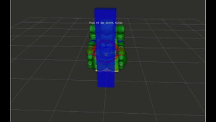

# Tactile Service Robot — Mobility Assistance

A ROS Noetic simulation of a dual-arm walking-assistive robot with whole-body adaptive admittance control.



## Overview

| Module                | Package                | Description                                                                 |
| --------------------- | ---------------------- | --------------------------------------------------------------------------- |
| Robot Description     | `dual_arm`           | URDF, SRDF, and rigid body models for the dual-arm mobile base              |
| Trajectory Generation | `optimal_traj`       | CasADi-based optimal trajectory planning for comfortable walking assistance |
| Admittance Control    | `tactile_compliance` | Whole-body adaptive admittance control using tactile feedback               |
| Message Types         | `util_msgs`          | Custom ROS message definitions                                              |

## Quick Start (Docker, Recommended)

The easiest way to run this project is with Docker, which handles all dependencies automatically.

```bash
git clone --recurse-submodules https://github.com/sunyu-robot/Tactile-Sevice-Robot-Mobility-Assistance.git
cd Tactile-Sevice-Robot-Mobility-Assistance

docker compose build
./run.sh
```

Inside the container:

```bash
roslaunch dual_arm gazebo.launch
```

## Manual Installation

### System Requirements

- Ubuntu 20.04
- [ROS Noetic](https://wiki.ros.org/noetic/Installation/Ubuntu)

### 1. Install system dependencies

```bash
sudo apt-get update && sudo apt-get install -y \
    build-essential cmake git \
    libeigen3-dev libfmt-dev \
    coinor-libipopt-dev gfortran \
    ros-noetic-joint-state-publisher-gui \
    ros-noetic-interactive-markers \
    ros-noetic-controller-manager \
    ros-noetic-ros-controllers \
    ros-noetic-gazebo-ros-pkgs \
    ros-noetic-gazebo-ros-control \
    ros-noetic-robot-state-publisher
```

### 2. Build dependencies from source

All sources are included under `dependecies/`. Build in order:

```bash
# OSQP
cmake -S dependecies/osqp -B /tmp/osqp-build -DCMAKE_BUILD_TYPE=Release -DCMAKE_INSTALL_PREFIX=/usr/local
sudo cmake --build /tmp/osqp-build --target install -j$(nproc)
sudo cp /usr/local/include/osqp/* /usr/local/include/

# osqp-eigen
cmake -S dependecies/osqp-eigen -B /tmp/osqp-eigen-build -DCMAKE_BUILD_TYPE=Release -DCMAKE_INSTALL_PREFIX=/usr/local
sudo cmake --build /tmp/osqp-eigen-build --target install -j$(nproc)

# HSL (MA27 linear solver — faster than MUMPS)
# Apply for free academic licence at https://licences.stfc.ac.uk/product/coin-hsl
# Place the coinhsl source under dependecies/casadi/external_packages/HSL, then:
cd dependecies/casadi/external_packages/HSL
./configure --prefix=/usr/local
make -j$(nproc) && sudo make install
sudo ln -sf /usr/local/lib/libcoinhsl.so /lib/x86_64-linux-gnu/libhsl.so
sudo ldconfig
cd ../../../..

# CasADi (with Ipopt + HSL support)
cmake -S dependecies/casadi -B /tmp/casadi-build \
    -DCMAKE_BUILD_TYPE=Release -DCMAKE_INSTALL_PREFIX=/usr/local \
    -DWITH_PYTHON=OFF -DWITH_EXAMPLES=OFF -DWITH_IPOPT=ON \
    -DWITH_HSL=ON -DHSL_LIBRARIES=/usr/local/lib/libcoinhsl.so
sudo cmake --build /tmp/casadi-build --target install -j$(nproc)

# fmt
cmake -S dependecies/fmt-8.1.1 -B /tmp/fmt-build \
    -DCMAKE_BUILD_TYPE=Release -DCMAKE_INSTALL_PREFIX=/usr/local -DFMT_TEST=OFF
sudo cmake --build /tmp/fmt-build --target install -j$(nproc)

# Sophus
cmake -S dependecies/Sophus-main-1.x -B /tmp/sophus-build \
    -DCMAKE_BUILD_TYPE=Release -DCMAKE_INSTALL_PREFIX=/usr/local
sudo cmake --build /tmp/sophus-build --target install -j$(nproc)

sudo ldconfig
```

### 3. Build ROS workspace

```bash
source /opt/ros/noetic/setup.bash
cd pinocchio_sim_ws
catkin_make -DCMAKE_BUILD_TYPE=Release
source devel/setup.bash
```

### 4. Run

```bash
roslaunch dual_arm gazebo.launch
```
